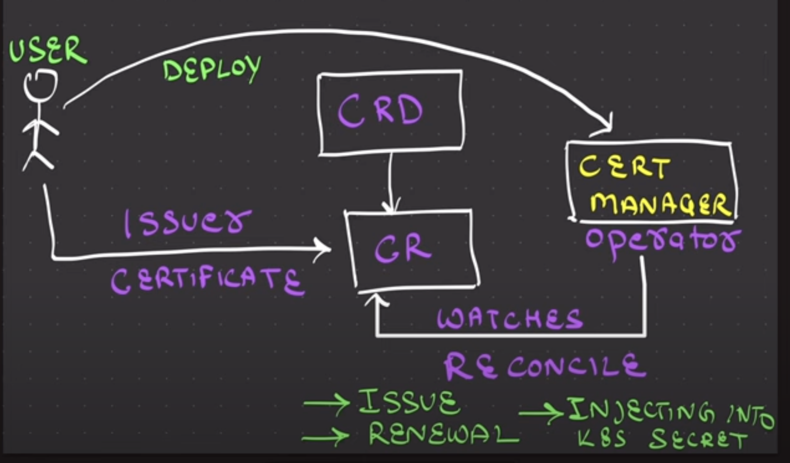

# Kubernetes Operator 

```
  video link :- https://www.youtube.com/watch?v=mTC3UZ8bHJc&t=1111s
  git repo :- https://github.com/piyushsachdeva/CKA-2024/blob/main/Resources/Day-50-Operators/README.md
  reading links :- https://sklar.rocks/kubernetes-custom-resource-definitions/
                   https://sklar.rocks/what-are-kubernetes-operators/

```
## 1. Understanding Kubernetes Operators

1. **Traditional vs Operator Pattern**

Traditional: Deploy application → Manual configuration → Manual scaling/updates
Operator: Deploy operator → Declare desired state → Operator handles everything

2. **Key Components**

- Custom Resource Definitions (CRDs): Extend Kubernetes API with new resource types
- Custom Resources (CRs): Instances of CRDs
- Controller: Watches CRs and reconciles actual state with desired state

3. **Why Use Operators?**

- Automate complex application lifecycle management
- Handle day-2 operations (backup, restore, scaling, updates)

The cert-manager Operator is a prime example. Instead of manually obtaining, renewing, and managing TLS certificates for your applications, you simply define Issuer and Certificate Custom Resources. The cert-manager Operator then watches these CRs and automatically handles the entire certificate lifecycle for you, including issuance from various sources (like Let's Encrypt), renewal, and even injecting them into Kubernetes Secrets.

### The Power of Reconciliation: The Operator's Core Feature

The fundamental mechanism by which a Kubernetes Operator works is called reconciliation. It refers to the continuous process where the Operator (specifically, its controller component) observes the actual state of resources in the Kubernetes cluster and constantly compares it to the desired state as defined in its Custom Resources.

Here's a breakdown of the reconciliation loop:

1. **Desired State (Custom Resources):** You, as the user, declaratively define the desired state of your application or component by creating or updating Custom Resources (e.g., a Certificate CR indicating you want a certificate for my-app.example.com , fot it the desired states are :- cert should be approved by issuer, should be valid always and will get renewed automalically ).

2. **Actual State (Kubernetes Resources):** The Operator continuously monitors the Kubernetes API for the current actual state of the relevant Custom Resources and the standard Kubernetes resources (like Pods, Deployments, Secrets, Services) that it manages.

3. **Reconciliation Loop:** The Operator runs a continuous "reconciliation loop" where it performs the following:
   - **Observes:** It fetches the current actual state of all relevant Kubernetes resources.
   - **Compares:** It compares this actual state with the desired state specified in your Custom Resources.
   - **Acts:** If there's any discrepancy (e.g., a certificate is missing, needs renewal, or a secret doesn't exist), the Operator takes the necessary imperative actions to bring the actual state in line with the desired state. This could involve creating new secrets, updating configurations, or interacting with external services (like a certificate authority).
   - **Loops:** This process is cyclical and continuous. The Operator keeps running this loop, ensuring that your declared desired state is maintained over time, even if something changes unexpectedly in the cluster.


### Introduction to Operator Lifecycle Manager (OLM)
3 types of operator installation tools :- kubectl, helm and OLM (installs operators from Operator Hub (https://operatorhub.io/), package manager for operators)
While Operators can be installed manually (e.g., using kubectl apply or Helm), the Operator Lifecycle Manager (OLM) simplifies the process of installing, upgrading, and managing Operators and their associated Custom Resource Definitions (CRDs) and Custom Resources (CRs). OLM acts as a "meta-operator" that manages other Operators, providing a consistent way to discover and deploy them in your cluster.




### How operator is diffrent from gitops tools:-

| Concept       | What It Is                          | What It Does                                                                                                                    |
| ------------- | ----------------------------------- | ------------------------------------------------------------------------------------------------------------------------------- |
| **GitOps**    | A **methodology / workflow**        | Uses Git as the **single source of truth** for Kubernetes (or infra) state and automates reconciliation from Git → cluster.     |
| **Operators** | A **software pattern (controller)** | Encapsulates operational knowledge in code — automates lifecycle management of specific apps or resources *inside* the cluster. |

🧠 Example to visualize
▶️ GitOps example (ArgoCD / Flux)

You push an updated Deployment.yaml to GitHub.
ArgoCD detects the change and updates the deployment in your cluster.
The cluster is reconciled to match Git.

➡️ Git is your “truth” and your cluster is always in sync.

▶️ Operator example (Prometheus Operator)

You apply a ServiceMonitor CRD that says: “Monitor all pods with label app=nginx.”
The Prometheus Operator’s controller sees that CRD and automatically configures Prometheus accordingly.
If new nginx pods come up, it updates Prometheus without you touching it.

➡️ The Operator acts autonomously inside the cluster.

💡 How they can work together
Deploy the Prometheus Operator via ArgoCD.
Store all your ServiceMonitor CRDs in Git.
ArgoCD ensures those CRDs are applied and kept consistent.

