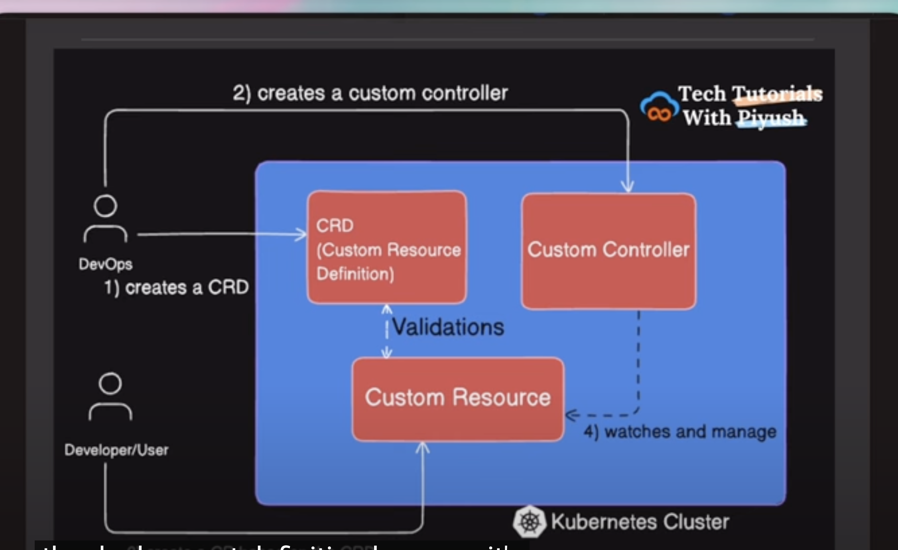

# Flux-CRD-K8s

```
    video link 1 :- https://www.youtube.com/watch?v=3huz7lRzUQo
    video link 2 :- 
```

## Understanding the Components

### What is a Custom Resource Definition (CRD)?

A CRD is a Kubernetes API extension that allows you to define custom resource types (like a json schema or template). It tells Kubernetes:
- What the new resource should be called
- What fields it should have
- How it should be validated
- What versions are supported

### What is a Custom Resource (CR)?

A Custom Resource is an instance of a CRD. It is not a default kubenetes object like pods or deployments.  It's the actual object that contains your specific configuration data , which are not covered by open source kubernetes.
eg :- monitor resources using kubernetes itself
      or implement gitops within the cluster without using any tool
      or implement cert manager with custom issuer

### What does the custom-controller do?

It manages the lifecycle of the custom resource . Always matches the desired state of the object according to the definition. 
The custom-controller is a Kubernetes controller that:
- Watches for changes to custom resources
- Creates and manages Deployments based on the custom resource specifications
- Updates the status of custom resources to reflect the current state (Reconciles actual state with desired state.)
- Implements the controller pattern for custom resources
- If one pod crashes, the controller creates a new one automatically.
Controller = logic that keeps Kubernetes resources in the desired state.

### Operators :-
-  A Controller is the mechanism that reconciles state.
An Operator is a pattern or application built using controllers + CRDs to automate one complex software application on Kubernetes. eg:- prometheus operator, EBS CSI Driver, Kafka operator
- Every Operator contains one or more Controllers —
but not every Controller is an Operator.



### Steps :-
```
-  Create the cluster 
-  git clone https://github.com/kubernetes/sample-controller
-  cd sample-controller
#  This tells Kubernetes about the new Foo API type :- 
-  kubectl create -f artifacts/examples/crd-status-subresource.yaml 
#  # Next, create an instance of your Foo custom resource. The sample-controller (running from Controller Step) will detect this new Foo object and create a Kubernetes Deployment according to its specification.
-  in artifacts/examples/example-foo.yaml make no of replicas to 20 and do
-  kubectl apply  -f artifacts/examples/example-foo.yaml it should give validation error
-  change it back to 2 and do kubectl apply again
-  $ k get foo (CR)
    NAME          AGE
    example-foo   66s
-  k describe crd foos.samplecontroller.k8s.io
-  k describe foo example-foo
-  k explain foo.spec.deploymentName
# Check deployments created through the custom resource
-  kubectl get deployments
# You should see both your example-foo custom resource and an example-foo-deployment (or similar name, depending on the controller's logic) listed. You can also get more details about the created deployment:
-  kubectl describe deployment example-foo-deployment
# Delete the custom resource instance
-  kubectl delete -f artifacts/examples/example-foo.yaml
# Delete the CustomResourceDefinition
-  kubectl delete -f artifacts/examples/crd-status-subresource.yaml
-  kubectl get events --sort-by=.metadata.creationTimestamp | tail -20

```

### Steps to run the controller :- 
```
- cd sample-controller
- go mod tidy
- go build -o sample-controller .
# Run the sample-controller.
# Keep this running in a separate terminal or in the background.
./sample-controller -kubeconfig=$HOME/.kube/config

```

### Install a tool cert-manager as CR using Helm without CRD :-
```
- helm repo add jetstack https://charts.jetstack.io --force-update
- helm install \
  cert-manager jetstack/cert-manager \
  --namespace cert-manager \
  --create-namespace \
  --version v1.17.2 \
  --set crds.enabled=false # if using custom crd from other sources , tested it with true

- Remember to stop the sample-controller process that you started in Step 2 (e.g., by pressing Ctrl+C in its terminal).
```
