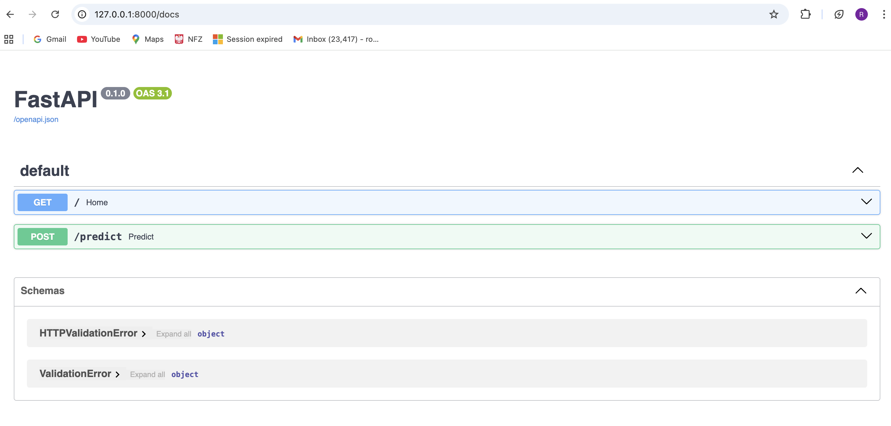
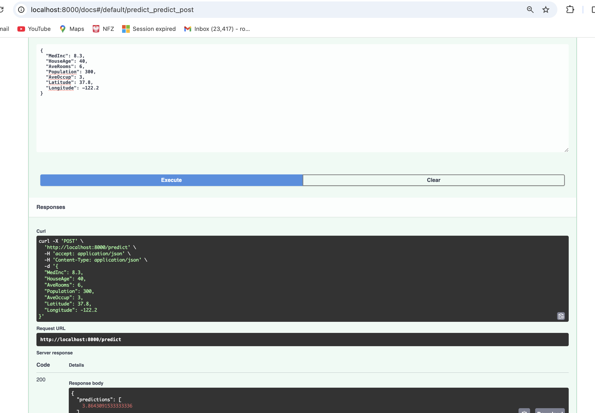
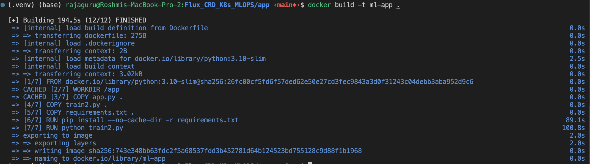
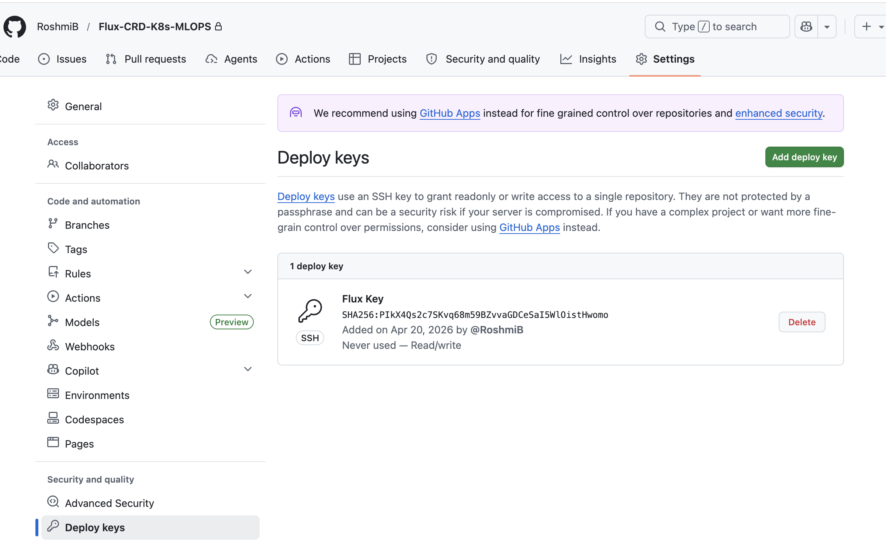

# 🚀 ML GitOps Deployment using FluxCD

This project demonstrates how to deploy a Machine Learning model using GitOps principles with FluxCD and Kubernetes.

## 🧩 Architecture

- FastAPI ML model
- Docker containerization
- Kubernetes deployment
- GitOps using FluxCD

## ⚙️ Workflow

1. Code pushed to GitHub
2. FluxCD watches repository
3. Automatically applies Kubernetes manifests
4. Deploys ML API to cluster

## 🔥 Features

- Automated deployments via GitOps
- Scalable Kubernetes setup
- Simple ML model serving API

## 🧪 API

### Predict:
GET /predict?x=5


## 📌 Future Improvements

- Add CI/CD pipeline
- Add monitoring (Prometheus)
- Add model versioning

Steps:- 
create one python venv first:-
1. source source /Users/rajaguru/Documents/interview_prep/Flux-CRD-K8s/.venv/bin/activate
2. pip install -r  requirements.txt
3. deactivate (to come out of venv)
4. python train.py
Output:
model.pkl
5. uvicorn app:app --reload


6. 👉 Open browser:
http://127.0.0.1:8000/docs
You’ll see Swagger UI



7. Example input 
{
  "MedInc": 8.3,
  "HouseAge": 40,
  "AveRooms": 6,
  "Population": 300,
  "AveOccup": 3,
  "Latitude": 37.8,
  "Longitude": -122.2
}

output :-



7. cd app
docker build -t ml-app .



8. docker run -p 8000:8000 ml-app

9. 
Build & push Docker image

aws ecr create-repository --repository-name ml-app

Login
aws ecr get-login-password --region us-west-2 | docker login --username AWS --password-stdin 725490567891.dkr.ecr.us-west-2.amazonaws.com
Login Succeeded

cat ~/.docker/config.json 
{
        "auths": {
                "725490567891.dkr.ecr.us-west-2.amazonaws.com": {},
                "aksdemosampleroshmi.azurecr.io": {},
                "https://index.docker.io/v1/": {},
                "public.ecr.aws": {}
        },
        "credsStore": "desktop"
}%                                              


docker tag ml-app:latest 725490567891.dkr.ecr.us-west-2.amazonaws.com/ml-app:v1
docker push 725490567891.dkr.ecr.us-west-2.amazonaws.com/ml-app:v1
👉 Replace in deployment.yaml

10. 
Create cluster :-
```
eksctl create cluster --name=test-cluster \
                  --region=us-west-2 \
                  --zones=us-west-2a,us-west-2b \
                  --without-nodegroup \
                  --version 1.34

eksctl utils associate-iam-oidc-provider \
--region us-west-2 \
--cluster test-cluster \
--approve

eksctl update addon --name vpc-cni --cluster=test-cluster

eksctl create addon --name aws-ebs-csi-driver --cluster test-cluster  --region us-west-2

eksctl utils migrate-to-pod-identity --cluster test-cluster --approve

eksctl create nodegroup --cluster=test-cluster \
                    --region=us-west-2 \
                    --name=test-cluster-node \
                    --node-type=t3.medium \
                    --nodes-min=1 \
                    --nodes-max=3 \
                    --node-ami-family AmazonLinux2023 \
                    --node-volume-size=20 \
                    --spot \
                    --managed \
                    --asg-access \
                    --external-dns-access \
                    --full-ecr-access \
                    --appmesh-access \
                    --alb-ingress-access \
                    --node-private-networking


Install AWS Load Balancer Controller
curl -O https://raw.githubusercontent.com/kubernetes-sigs/aws-load-balancer-controller/main/docs/install/iam_policy.json

aws iam create-policy \
  --policy-name AWSLoadBalancerControllerIAMPolicy \
  --policy-document file://iam_policy.json

eksctl create iamserviceaccount \
    --cluster=test-cluster \
    --namespace=kube-system \
    --name=aws-load-balancer-controller \
    --attach-policy-arn=arn:aws:iam::725490567891:policy/AWSLoadBalancerControllerIAMPolicy \
    --override-existing-serviceaccounts \
    --region us-west-2 \
    --approve

helm repo add eks https://aws.github.io/eks-charts
helm repo update

helm install aws-load-balancer-controller eks/aws-load-balancer-controller -n kube-system --set clusterName=test-cluster --set serviceAccount.create=false --set serviceAccount.name=aws-load-balancer-controller


kubectl get pods -n kube-system
```


10. 

Install Flux :-
  brew install fluxcd/tap/flux
  flux --help  
# Check prerequisites
  flux check --pre
  ```
   ► checking prerequisites
    ✗ flux 2.7.0 <2.8.5 (new CLI version is available, please upgrade)
    ✔ Kubernetes 1.34.4-eks-f69f56f >=1.32.0-0
    ✔ prerequisites checks passed
  ```

# Install the latest version of Flux
  flux install

```
    ✚ generating manifests
    ✔ manifests build completed
    ► installing components in flux-system namespace
    CustomResourceDefinition/alerts.notification.toolkit.fluxcd.io created
    CustomResourceDefinition/buckets.source.toolkit.fluxcd.io created
    CustomResourceDefinition/externalartifacts.source.toolkit.fluxcd.io created
    CustomResourceDefinition/gitrepositories.source.toolkit.fluxcd.io created
    CustomResourceDefinition/helmcharts.source.toolkit.fluxcd.io created
    CustomResourceDefinition/helmreleases.helm.toolkit.fluxcd.io created
    CustomResourceDefinition/helmrepositories.source.toolkit.fluxcd.io created
    CustomResourceDefinition/kustomizations.kustomize.toolkit.fluxcd.io created
    CustomResourceDefinition/ocirepositories.source.toolkit.fluxcd.io created
    CustomResourceDefinition/providers.notification.toolkit.fluxcd.io created
    CustomResourceDefinition/receivers.notification.toolkit.fluxcd.io created
    Namespace/flux-system created
    ClusterRole/crd-controller-flux-system created
    ClusterRole/flux-edit-flux-system created
    ClusterRole/flux-view-flux-system created
    ClusterRoleBinding/cluster-reconciler-flux-system created
    ClusterRoleBinding/crd-controller-flux-system created
    ResourceQuota/flux-system/critical-pods-flux-system created
    ServiceAccount/flux-system/helm-controller created
    ServiceAccount/flux-system/kustomize-controller created
    ServiceAccount/flux-system/notification-controller created
    ServiceAccount/flux-system/source-controller created
    Service/flux-system/notification-controller created
    Service/flux-system/source-controller created
    Service/flux-system/webhook-receiver created
    Deployment/flux-system/helm-controller created
    Deployment/flux-system/kustomize-controller created
    Deployment/flux-system/notification-controller created
    Deployment/flux-system/source-controller created
    NetworkPolicy/flux-system/allow-egress created
    NetworkPolicy/flux-system/allow-scraping created
    NetworkPolicy/flux-system/allow-webhooks created
    ◎ verifying installation
    ✔ helm-controller: deployment ready
    ✔ kustomize-controller: deployment ready
    ✔ notification-controller: deployment ready
    ✔ source-controller: deployment ready
    ✔ install finished

```

🔑 Generate GitHub token
  👉 Go to GitHub → Settings → Developer Settings → Personal Access Token
  Permissions:
  repo
  admin:repo_hook


Connect repo to cluster :-
flux bootstrap github \
  --owner=YOUR_USERNAME \
  --repository=ml-gitops-flux-demo \  
  --branch=main \
  --path=./clusters/dev \
  --personal

Verify deployment:-
kubectl get pods
kubectl get svc

Access app:- 
minikube service ml-api

11. Flux video :- 
    https://www.youtube.com/watch?v=DqXDrAR4cJ4

    doc :- https://fluxcd.io/flux/installation/#install-the-flux-cli
           https://fluxcd.io/flux/installation/bootstrap/github/

12. Flux Bootstrap with Deploy Key (not tied to user PAT)
    🔑 STEP 1 — Generate SSH Key
        ssh-keygen -t ed25519 -C "flux" -f ./flux-key -N ""
        👉 Creates:
          flux-key (private)
          flux-key.pub (public)
    
    📌 STEP 2 — Add Deploy Key to GitHub
        

         cat flux-key.pub
         ☑ Allow write access

    🚀 STEP 3 — Bootstrap Flux (SSH mode)
        flux bootstrap git \
          --url=ssh://git@github.com/RoshmiB/Flux-CRD-K8s-MLOPS.git \
          --branch=main \
          --path=./K8s \
          --private-key-file=./flux-key

    🎯 What this does
        Installs Flux in cluster
        Uses SSH key for auth
        Watches your repo
        Syncs /k8s folder